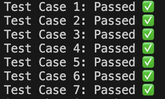

# Longest Common Prefix

This project contains a Node.js function to find the longest common prefix string amongst an array of strings. If there is no common prefix, the function returns an empty string.

## Problem Statement

Given an array of strings, write a function to find the longest common prefix string amongst the strings. If there is no common prefix, return an empty string.

### Example 1

- **Input**: `["flower","flow","flight"]`
- **Output**: `"fl"`

### Example 2

- **Input**: `["dog","racecar","car"]`
- **Output**: `""`
- **Explanation**: There is no common prefix among the input strings.

### Constraints

- 1 <= strs.length <= 200
- 0 <= strs[i].length <= 200
- strs[i] consists of only lower-case English letters.

## Getting Started

These instructions will help you set up and run the project on your local machine for development and testing purposes.

### Prerequisites

- Node.js installed on your local machine. You can download it from [nodejs.org](https://nodejs.org/).

### Installation

1. Clone the repository:

   ```bash
   git clone https://github.com/jeeraphanl/longest-common-prefix
   cd longest-common-prefix

2. Install the dependencies
    ```bash
    npm install

3. Run the test cases:
    ```bash
    node index.js

